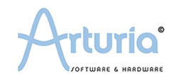
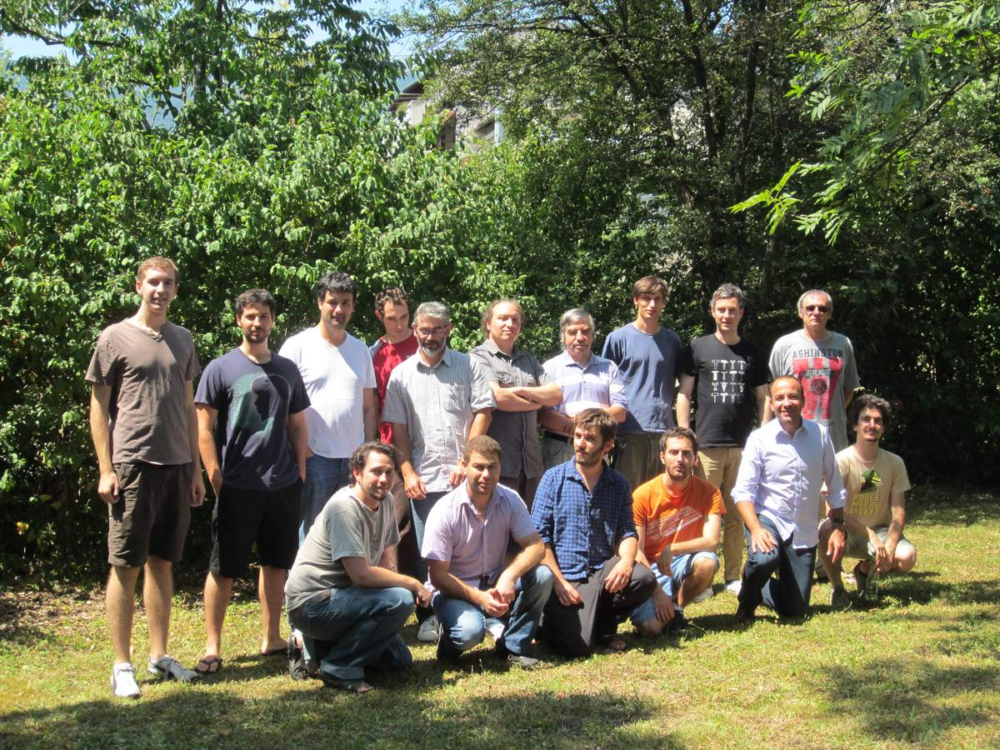

<!--
title: Grenoble
date: 19 August 2012
-->
This summer I had a unique opportunity to travel to Grenoble, France and work for a company that specializes in electronic musical instruments.

[Arturia](http://arturia.com) is focused on music software and hardware for professional and amateur musicians. They specialize in bringing classic hardware synthesizers to your DAW as a software synth. Here are a few of my favorite hardware and software instruments that I worked with:

[MiniBrute](http://www.arturia.com/evolution/en/products/minibrute/intro.html)
 | [Spark Vintage](http://www.arturia.com/evolution/en/products/spark-vdm/intro.html)
 | [Oberheim SEM V](http://www.arturia.com/evolution/en/products/oberheimsemv/intro.html)
 | [Wurlitzer V](http://www.arturia.com/evolution/en/products/wurlitzer-v/intro.html)
 | [Jupiter-8 V](http://www.arturia.com/evolution/en/products/jupiter-8v/intro.html)
 | [Prophet V](http://www.arturia.com/evolution/en/products/prophetv/intro.html)
 | [ARP 2600 V](http://www.arturia.com/evolution/en/products/arp2600v/intro.html)
 | [Yamaha CS 80 V](http://www.arturia.com/evolution/en/products/cs-80v/intro.html)
 | [Origin](http://www.arturia.com/evolution/en/products/origin-keyboard/intro.html)

My project was to create an iPad app that allowed users of the MiniBrute to store presets and share them online.

The implementation was two separate components: a Rails web server and the Objective C iPad client.

My project involved designing, developing, and testing an iOS app and Ruby on Rails web server.

I was also a tester for new releases of Arturia software, specifically the V Collection 3. I even got my hands on a MiniBrute. Testing music software is interesting because audio plugins need to work properly with a variety of DAWs. Testing is a high priority at Arturia.

Since I was a native english speaker, I was consulted on various documents and promotional material, to help translate and fix grammar. Almost every day I learned something about French, and often I discovered things about English and the etymology of certain words. For example, "stage" and "stagiare" are often translated as "internship" and "intern", but "stage" really means "work placement." and the lengths and terms of the stage are often specified by the french university based on the year of the student.

I was even included in an upcoming video for the V Collection. The video looks great and features my voice as the narrator.

<iframe width="560" height="315" src="http://www.youtube.com/embed/ZfMRtUbXYOY" frameborder="0" allowfullscreen></iframe>

Everyday I woke up excited for work. My project was rewarding, the people I worked with were amazing, and Grenoble was a surreal place to live and work. I look forward to keeping in touch with all the friends I made at Arturia and in Grenoble.

